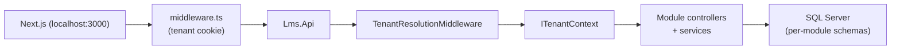
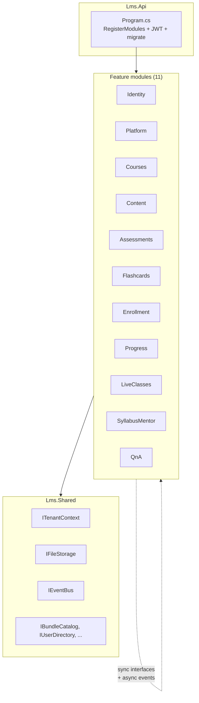
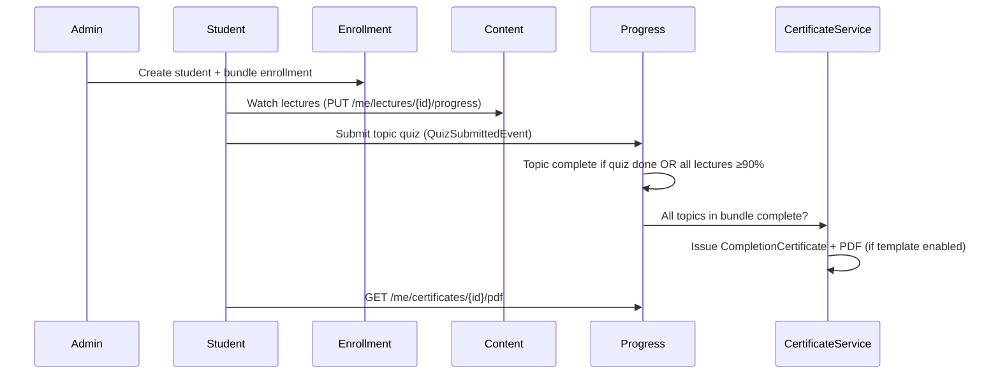
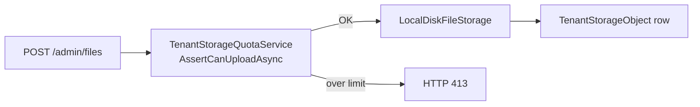

# White-Label LMS — Technical Handover

**Audience:** New engineer taking over the codebase  
**Last updated:** June 2026  
**Status:** Internal engineering document

---

## 1. Executive summary

**White-Label AI LMS** is a multi-tenant SaaS learning platform for exam-prep academies (MDCAT, ECAT, etc.) and general course providers. Each institute (tenant) gets isolated data, branding, feature flags, and a product profile — all on **one shared codebase**, not per-client forks.

| Aspect | Choice |
|--------|--------|
| Backend | .NET 10 modular monolith, SQL Server, EF Core |
| Frontend | Next.js 15 App Router, React 19, Tailwind |
| Tenancy | Row-level isolation via `TenantId` + global query filters |
| Auth | JWT (access + refresh), five roles |
| Deployment model | Single API + single web app; tenants distinguished by subdomain or `?tenant=slug` |

**Product boundary:** LMS only (courses, live classes, MCQs, AI tutor, white-label). Not MockPilot (mock APIs, collections, API keys).

---

## 2. Repository layout

```
white-label-lms/
├── backend/
│   ├── src/
│   │   ├── Lms.Api/              # Host: Program.cs, middleware, seeders, Swagger
│   │   ├── Lms.Shared/           # Shared kernel: tenancy, auth, IFileStorage, cross-module contracts
│   │   └── Modules/
│   │       ├── Lms.Modules.Identity/
│   │       ├── Lms.Modules.Platform/
│   │       ├── Lms.Modules.Courses/
│   │       ├── Lms.Modules.Content/
│   │       ├── Lms.Modules.Assessments/
│   │       ├── Lms.Modules.Flashcards/
│   │       ├── Lms.Modules.Enrollment/
│   │       ├── Lms.Modules.Progress/
│   │       ├── Lms.Modules.LiveClasses/
│   │       ├── Lms.Modules.SyllabusMentor/
│   │       └── Lms.Modules.QnA/
│   ├── scripts/                  # PowerShell API smoke tests (test-*.ps1)
│   └── docker-compose.yml        # SQL Server for local dev
├── frontend/
│   └── src/
│       ├── app/                  # Next.js App Router pages
│       └── lib/                  # api.ts, auth.ts, admin-nav-config.ts, product-profile.ts
├── scripts/                      # E2E seed + full API test suite
└── frontend/docs/                # Product + engineering docs (this folder)
```

**Entry points:**

| Stack | Command | Directory |
|-------|---------|-----------|
| API | `dotnet run --project src/Lms.Api` | `backend/` |
| Frontend | `npm run dev` | `frontend/` |
| DB | `docker compose up -d` | `backend/` |

There is **no root-level `package.json`**. Backend and frontend are independent.

---

## 3. Architecture diagram

### Request flow



### Modular monolith boundaries



Each module implements `IModule`: registers its DbContext, services, and exposes controllers via `AddApplicationPart`. Cross-module communication uses **shared interfaces** in `Lms.Shared` (sync) and **domain events** via `IEventBus` (async). Modules do **not** reference each other's DbContexts directly.

---

## 4. Multi-tenancy

### Core concepts

| Concept | Location | Purpose |
|---------|----------|---------|
| `TenantId` | Every `TenantEntity` row | Row-level isolation |
| `ITenantContext` | `Lms.Shared/Tenancy/TenantContext.cs` | Current request's tenant |
| Global query filters | Each module's `DbContext` | Auto-filter `WHERE TenantId = @current` |
| `IgnoreQueryFilters()` | Login, SuperAdmin ops | Cross-tenant reads when needed |

### Tenant resolution order

1. **JWT claim** — `tenant_id` on institute users  
2. **Subdomain** — `demo.localhost:3000` → slug `demo` (`TenantResolutionMiddleware`)  
3. **Query param / header** — `?tenant=demo` or `X-Tenant-Slug: demo`  
4. **Cookie** — Next.js `middleware.ts` sets `lms.tenantSlug` for API calls

SuperAdmin and Support use the **system tenant** (platform scope, not an institute).

### Frontend tenant handling

- `frontend/src/lib/tenant.ts` — read slug from URL/cookie  
- `frontend/src/lib/api.ts` — sends `X-Tenant-Slug` on institute requests  
- `frontend/src/middleware.ts` — persists tenant slug cookie

---

## 5. Auth & roles

### Roles (`Lms.Shared/Auth/Roles.cs`)

| Role | Scope | Typical login |
|------|-------|---------------|
| **SuperAdmin** | All tenants, platform ops | `/login` (no tenant) |
| **Support** | Incident search only | `/login/platform` |
| **InstituteAdmin** | Full institute management | `/login?tenant=demo` |
| **Teacher** | Assigned subjects only | `/login?tenant=demo` |
| **Student** | Learning portal | `/login?tenant=demo` |

### Authorization policies (`Program.cs`)

| Policy | Roles allowed |
|--------|---------------|
| `SuperAdmin` | SuperAdmin |
| `PlatformStaff` | SuperAdmin, Support |
| `InstituteAdmin` | SuperAdmin, InstituteAdmin |
| `Teacher` | SuperAdmin, InstituteAdmin, Teacher |

Admin endpoints use `[Authorize(Policy = "Teacher")]` — teachers and above. Institute-only settings use `InstituteAdmin`.

### Token flow

- Login → JWT access token + refresh token  
- Frontend stores tokens in `lib/auth.ts` (localStorage)  
- `lib/api.ts` attaches `Authorization: Bearer …`  
- File downloads can pass `?access_token=` for `<video>` / `` tags

---

## 6. Product profiles & feature flags

### Product profiles

Set per tenant by SuperAdmin. Parsed on frontend via `lib/product-profile.ts`.

| Profile | UI labels | Default modules |
|---------|-----------|-----------------|
| **ExamPrep** | "batch" | Mocks, doubts, mistake diary, unit tests ON |
| **GeneralLms** | "course" | Academy gamification OFF by default |
| **Both** | "batch or course" | Academy modules ON; general course wording where needed |

**Rule:** Never hard-code exam-prep-only copy. Use `profileBundleLabel()`, `hasMockExams()`, `hasDoubts()`, etc.

### Tenant feature flags (`TenantFeatures`)

Stored on `platform.Tenants`. Returned in login response as `tenant` object.

Examples: `LiveClassesEnabled`, `SyllabusMentorEnabled`, `AllowStudentSelfEnroll`, `AllowAdminCreateStudent`, `MockExamsEnabled`, `Status` (Trial/Active/Suspended).

Frontend gates nav items in `admin-nav-config.ts` and student routes via `student-access.ts`.

---

## 7. Module responsibilities

| Module | Schema | Key entities | Main API areas |
|--------|--------|--------------|----------------|
| **Identity** | `identity` | User, RefreshToken, PasswordResetToken, StudentGuardian | `/auth/*`, `/admin/students`, `/admin/teachers` |
| **Platform** | `platform` | Tenant, TenantSettings, LandingPage, TenantStorageObject, RequestIncident | `/superadmin/*`, `/admin/settings/*`, `/public/branding`, `/admin/storage` |
| **Courses** | `courses` | Bundle, Subject, Unit, Topic, SubjectDefinition, SubjectTeacher | `/bundles`, `/admin/*` course tree, subject catalog |
| **Content** | `content` | Lecture, Note | `/topics/{id}/content`, `/admin/files`, `/files/{key}` |
| **Assessments** | `assessments` | Quiz, Question, Attempt, MockExam* | `/topics/{id}/quiz`, `/admin/questions/search`, mock exams |
| **Flashcards** | `flashcards` | FlashcardDeck, Flashcard | `/topics/{id}/flashcards` |
| **Enrollment** | `enrollment` | Enrollment | `/bundles/{id}/enroll`, `/me/enrollments` |
| **Progress** | `progress` | QuizResult, MistakeEntry, Bookmark, LectureWatchProgress, CompletionCertificate, CertificateTemplate | `/me/grades`, `/me/lectures/*/progress`, `/me/certificates`, `/admin/analytics`, `/admin/certificates` |
| **LiveClasses** | `live` | LiveClass, LiveClassAttendance | `/me/live-classes`, `/admin/live-classes` |
| **SyllabusMentor** | `mentor` | KnowledgeChunk | `/ai/ask`, `/admin/ai/ingest` |
| **QnA** | `qna` | DoubtThread, DoubtMessage, DoubtReplyTemplate | `/me/doubts`, `/admin/doubts` |

### Shared cross-module contracts (examples)

| Interface | Implemented by | Used for |
|-----------|----------------|----------|
| `IBundleCatalog` | Courses | Enrollment expiry, live class scoping |
| `IEnrollmentReader` / `IEnrollmentWriter` | Enrollment | Admin student create + enroll |
| `IUserDirectory` | Identity | Leaderboard display names |
| `ISubjectAccessService` | Courses | Teacher subject scoping |
| `ITenantStorageQuotaService` | Platform | Upload quota checks |
| `IFileStorage` | Shared (LocalDisk) | All file uploads/downloads |

---

## 8. Key business flows

### 8.1 Enrollment → learning → certificate



**Key files:**

| Step | Backend | Frontend |
|------|---------|----------|
| Enrollment | `EnrollmentModule`, `AdminUsersController` | `/admin/students` |
| Video progress | `VideoProgressService`, `ProgressController` | `ProtectedVideo`, `/videos` |
| Topic completion | `TopicCompletionService` (Progress) | Dashboard bundle bars |
| Certificate issue | `CertificateIssuanceService`, QuestPDF | `/certificates`, `/admin/certificates` |
| Template | `CertificateTemplateService` | `/admin/certificates/template` |
| Public verify | `PublicCertificatesController` | `/verify/[number]` |

**Completion rule (per topic):** quiz submitted **OR** all lectures in topic watched ≥ 90%.  
**Bundle certificate:** every topic in bundle complete + active enrollment + template `Enabled = true`.

### 8.2 File upload → storage quota



**Key files:**

- `Lms.Shared/Storage/IFileStorage.cs` — abstraction  
- `LocalDiskFileStorage` — MVP provider (local disk under configured path)  
- `TenantStorageQuotaService` — plan limits (MVP 20 GB, Pro 100 GB from `StorageQuota` in appsettings)  
- `AdminStorageController`, `SuperAdminTenantsController` — usage + override/bypass  
- Upload filter returns **413** when quota exceeded

**Pitfall:** Files uploaded before metering may not appear in usage until backfilled into `TenantStorageObject`.

### 8.3 SuperAdmin tenant provisioning

1. `POST /api/v1/superadmin/tenants` — create tenant row (slug, plan, profile)  
2. `PUT …/flags` — enable live classes, mentor, self-enroll, etc.  
3. `POST …/admins` — provision InstituteAdmin via `IInstituteAdminProvisioner`  
4. Institute admin logs in at `/login?tenant={slug}`, runs setup wizard  
5. Optional: branding override, storage quota override at tenant detail

**Key files:** `SuperAdminTenantsController`, `InstituteAdminProvisioner`, `/superadmin/tenants/[id]`

---

## 9. Database

| Item | Detail |
|------|--------|
| Engine | SQL Server 2022 (Docker locally on port **14330**) |
| Database name | `WhiteLabelLms` |
| ORM | EF Core 10, code-first migrations per module |
| Schemas | `identity`, `platform`, `courses`, `content`, `assessments`, `flashcards`, `enrollment`, `progress`, `live`, `mentor`, `qna` |

### Auto-migrate on startup

In **Development** only, `Program.cs` runs `Database.MigrateAsync()` for each module DbContext, then seeders (Identity, Courses, Content, Assessments, etc.).

```csharp
// backend/src/Lms.Api/Program.cs (simplified)
await identityDb.Database.MigrateAsync();
await coursesDb.Database.MigrateAsync();
// ... all module contexts
```

**Do not rely on this in production** — use explicit migration deployment in CI/CD.

### Base entity pattern

- `BaseEntity` — `Id`, audit fields  
- `TenantEntity : BaseEntity` — adds `TenantId`; global filter applied in each DbContext

---

## 10. Frontend structure

### Core libraries

| File | Purpose |
|------|---------|
| `lib/api.ts` | All REST calls; typed DTOs; base URL from env |
| `lib/auth.ts` | Token storage, session, role helpers (`canManageInstitute`) |
| `lib/admin-nav-config.ts` | Role/profile-gated admin sidebar |
| `lib/product-profile.ts` | ExamPrep / GeneralLms / Both helpers |
| `lib/branding.ts` | CSS `--brand` variable from tenant branding |
| `lib/student-access.ts` | Gate student routes by flags |

### Route map (main surfaces)

| Role | Routes |
|------|--------|
| **Public** | `/`, `/login`, `/forgot-password`, `/verify/[number]` |
| **Student** | `/dashboard`, `/videos`, `/topic/[id]`, `/quiz/[topicId]`, `/certificates`, `/bookmarks`, `/mistakes`, `/weakness-quiz`, `/mentor`, `/doubts`, `/mock-exams` |
| **Admin / Teacher** | `/admin/home`, `/admin`, `/admin/progress`, `/admin/analytics`, `/admin/question-bank`, `/admin/certificates`, `/admin/certificates/template`, `/admin/students`, `/admin/teachers`, `/admin/live-classes`, `/admin/doubts`, `/admin/settings/*` |
| **SuperAdmin** | `/superadmin`, `/superadmin/tenants/[id]` |
| **Support** | `/support` |

Admin nav is built dynamically — teachers see a subset (no Students/Teachers/Settings tabs).

### App Router layout

- `app/(protected)/` — auth-required routes  
- `app/admin/` — institute admin + teacher  
- `app/superadmin/` — platform operator  
- Server Components fetch public branding; client components use TanStack patterns via `api.ts`

---

## 11. Local dev setup

### Prerequisites

- .NET 10 SDK  
- Node.js 20+  
- Docker Desktop (SQL Server)

### Steps

```bash
# 1. Database
cd backend
docker compose up -d

# 2. API (auto-migrates + seeds demo tenant)
dotnet run --project src/Lms.Api
# → http://localhost:5237/swagger

# 3. Frontend
cd ../frontend
npm install
npm run dev
# → http://localhost:3000
```

### Demo tenant

| Account | Email | Password |
|---------|-------|----------|
| Institute Admin | `admin@demo.com` | `Admin123!` |
| Student | `student1@demo.com` | (see seed / test scripts) |
| SuperAdmin | `superadmin@platform.com` | `SuperAdmin123!` |

Open institute users with **`?tenant=demo`**: http://localhost:3000/login?tenant=demo

### Optional: E2E test data

```powershell
.\scripts\e2e-seed-testdata.ps1
# Passwords → scripts/e2e-test-credentials.json
```

### Environment

- API URL: `frontend/.env.local` → `NEXT_PUBLIC_API_URL=http://localhost:5237`  
- CORS allows `localhost:3000` and `*.localhost:3000`

---

## 12. Test scripts

### `backend/scripts/` (feature smoke tests)

| Script | Purpose |
|--------|---------|
| `test-roadmap-features.ps1` | Video progress, certificates list, MCQ search, cohort analytics, dashboard bundle progress (**11 tests**) |
| `test-certificate-student1.ps1` | Full certificate flow: complete bundle, PDF download, public verify (**9/9**) |
| `test-storage-quota.ps1` | Admin storage GET, SuperAdmin override/bypass, 413 on over-quota upload |
| `test-student-learning-features.ps1` | Bookmarks, global search, weakness quiz |
| `test-product-profiles.ps1` | ExamPrep / GeneralLms / Both flag gating (**22 tests**) |
| `test-subject-catalog.ps1` | Subject catalog CRUD + shared library |
| `test-mock-exam-publish.ps1` | Mock exam publish workflow |
| `check-tenant-catalog.ps1` | Diagnostic: report catalog + batch links for a tenant slug |

Run with API up on port 5237:

```powershell
cd backend/scripts
.\test-roadmap-features.ps1
```

Results JSON written alongside scripts (e.g. `test-roadmap-features-results.json`).

### `scripts/` (full E2E)

| Script | Purpose |
|--------|---------|
| `e2e-seed-testdata.ps1` | Seed teachers, students, enrollments for demo tenant |
| `e2e-run-api-tests.ps1` | All-role API smoke (19 tests) |
| `e2e-teacher-student-flow.ps1` | Teacher → student interaction flow |

Formal QA report: `05-E2E-Test-Report.md`.

---

## 13. Common pitfalls

| Symptom | Likely cause | Fix |
|---------|--------------|-----|
| Frontend "Loading…" forever | API not running | Start `dotnet run` on port 5237 |
| Login fails for institute user | Missing tenant context | Use `?tenant=demo` or subdomain |
| `dotnet build` file lock error | API still running | Stop API process before rebuild |
| Upload returns 413 | Storage quota exceeded | Free space, SuperAdmin override, or bypass |
| Storage widget shows 0 | Pre-metering files | Backfill `TenantStorageObject` or re-upload |
| Certificate not issued | Template disabled | Enable at `/admin/certificates/template` |
| Certificate not issued | Topics incomplete | All topics need quiz **or** ≥90% video watch |
| Teacher empty CMS | No subject assignment | Institute admin assigns subjects |
| Student no courses | Not enrolled | Admin creates student with bundle |
| Swagger 401 | Missing Bearer token | Login first, use Authorize button |
| CORS error on subdomain | Origin not allowed | Check `Cors:Origins` in appsettings |
| Emails not sent | SMTP not configured | Check `backend/dev-emails/*.html` outbox in dev |

---

## 14. Roadmap / not built

| Area | Status |
|------|--------|
| Native mobile apps (iOS / Android) | Not started |
| In-app payments / student checkout | Not started |
| Parent portal (guardian login) | Email reports only; no login |
| Certificate Phase B | Phase A shipped (PDF + QR). B = custom fields, email delivery, batch re-issue |
| Discussions / forums | Not built (doubts cover Ask Teacher) |
| Proctoring / anti-cheat | Not built |
| Platform billing (seats, API metering) | Storage quota only; full billing TBD |
| Tenant API keys / webhooks | Not built |
| Cloud file storage (R2 / Azure) | `IFileStorage` exists; only `LocalDiskFileStorage` implemented |
| Full mock exams module | Partial — see `04-Build-Progress-Tracker.md` module 17 |

---

## 15. Related documents

| Doc | Use when |
|-----|----------|
| [03-Technical-Architecture-LMS.md](./03-Technical-Architecture-LMS.md) | Original build spec, stack rationale, phase plan |
| [04-Build-Progress-Tracker.md](./04-Build-Progress-Tracker.md) | Module completion status + changelog |
| [07-Role-Based-Operations-Guide.md](./07-Role-Based-Operations-Guide.md) | Login URLs, step-by-step UAT by role |
| [08-Product-Feature-Catalog.md](./08-Product-Feature-Catalog.md) | Feature list + API quick reference |
| [10-Client-Feature-List-By-Role.md](./10-Client-Feature-List-By-Role.md) | Client-facing scope by role |
| [11-Roadmap-Features-E2E-Report.md](./11-Roadmap-Features-E2E-Report.md) | Jun 2026 shipped features validation |
| [09-Customization-Policy.md](./09-Customization-Policy.md) | Branding vs bespoke work boundaries |
| `AGENTS.md` (repo root) | Agent/copilot conventions |

---

## Quick orientation checklist

For a new engineer's first day:

- [ ] Clone repo, run Docker + API + frontend (§11)  
- [ ] Log in as admin + student on demo tenant  
- [ ] Open Swagger at http://localhost:5237/swagger  
- [ ] Trace one request: login → `TenantContext` → module controller  
- [ ] Run `backend/scripts/test-roadmap-features.ps1` — all green  
- [ ] Read `Program.cs` module registration and migration block  
- [ ] Skim `lib/api.ts` for API surface  
- [ ] Review `04-Build-Progress-Tracker.md` for what's done vs remaining  

---

*Questions about product scope → docs 08/10. Questions about running the app → doc 07. Architecture deep-dive → doc 03.*
